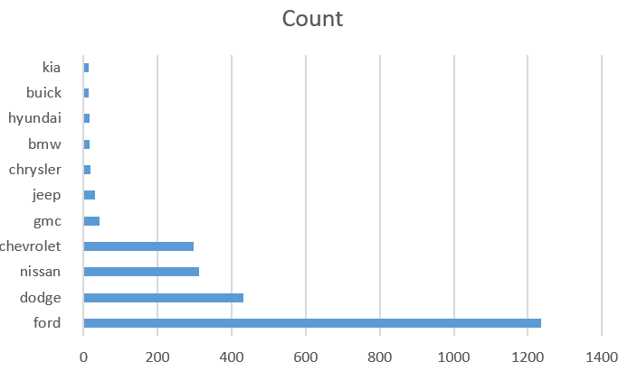

# map-reduce-mula
## Data Description
- In this dataset, you will find the 12 features that describe 2499 vehicles for sale in US.
- This Dataset is a free resource from Kaggle.

## Study
- For this Dataset, I want to find out the total count of Top 10 brands in USA.

## Powershell Command
- cat USA_cars_datasets.csv | python 81mapper.py | sort | python 81reducer.py > mula-output.txt

## Chart
